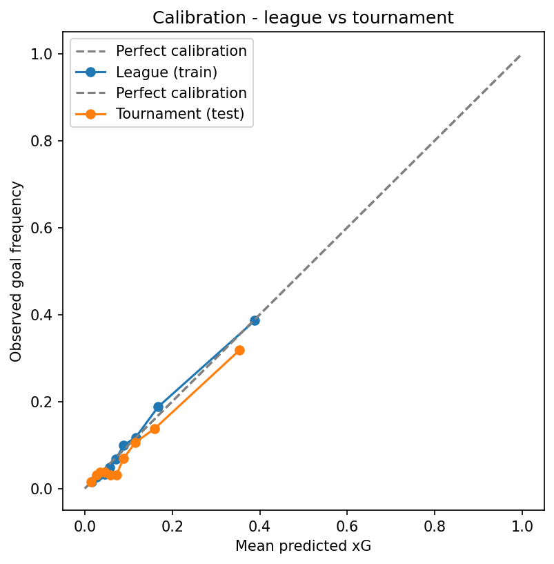
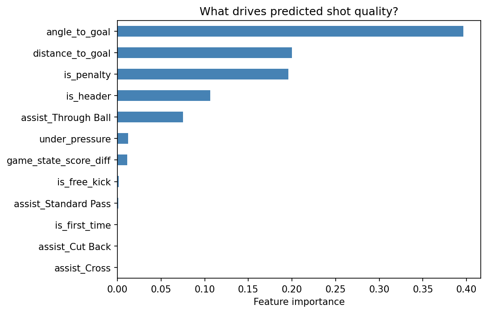
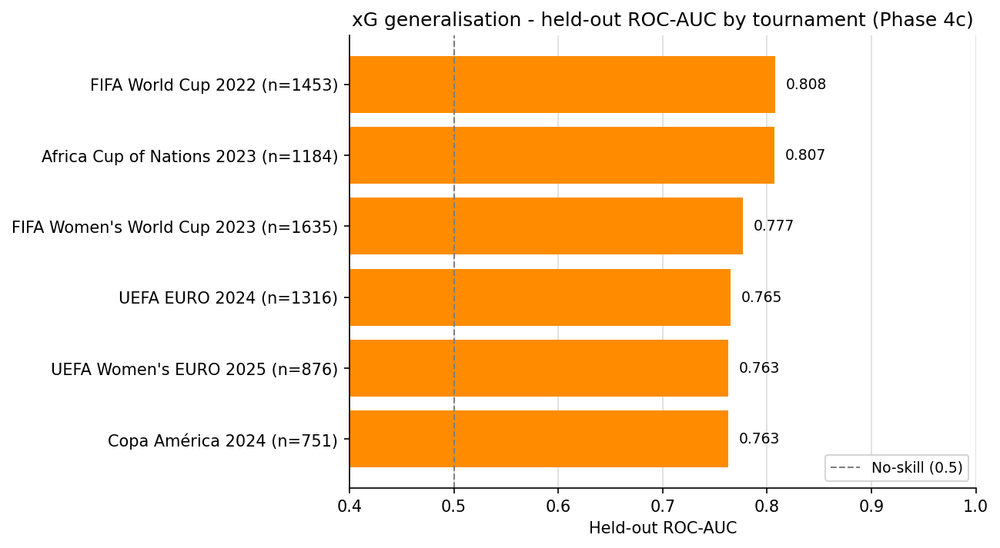
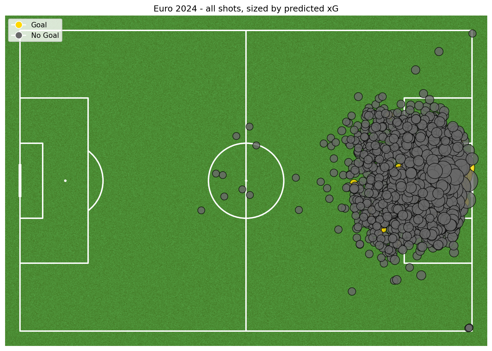
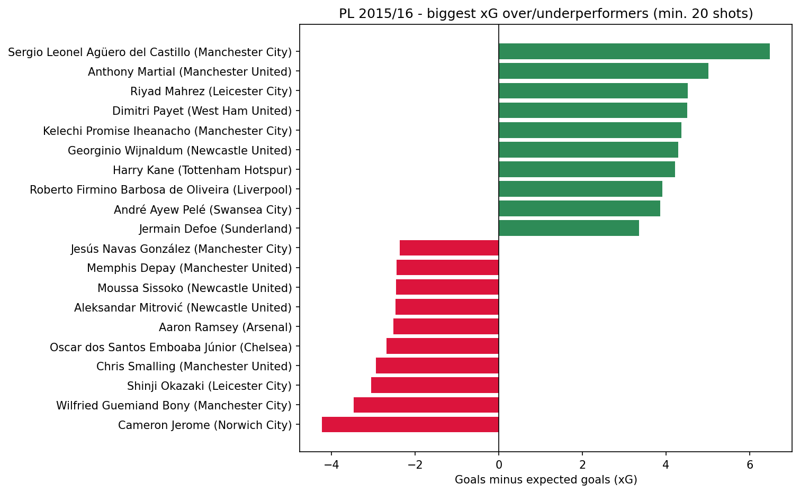
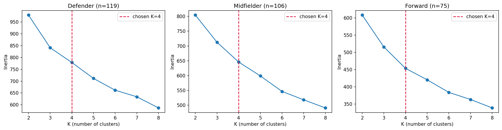
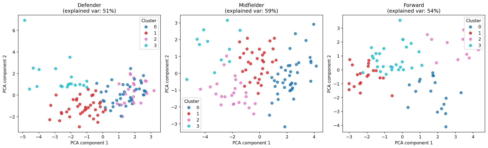
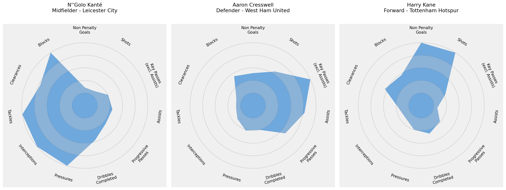

# Football Analytics Portfolio — Player Evaluation Framework

[](https://github.com/GuiPadinha/football-analytics-portfolio/actions/workflows/tests.yml)

**[Live demo](https://gpfootball-analytics-portfolio.streamlit.app)** — Streamlit Community Cloud, Phase 8 (deployed 2026-07-09).

A two-part analytics project built on public StatsBomb and SkillCorner data, designed to answer
two questions a recruitment or performance analysis team actually asks:

1. **Was that shot a good chance, or did the player just finish well?** (Module A — Expected Goals)
2. **Who plays like this player, and what type of player are they?** (Module B — Player Similarity)

Together these form a lightweight **Player Evaluation Framework** — the same kind of question set
used by recruitment and analytics teams at top-level clubs and data providers.

> New here? **[docs/FRAMEWORK.md](docs/FRAMEWORK.md)** explains in one page who the tool is for,
> what you put in, and what you get out.

Built by **Guilherme Padinha** — Data Engineer with a semi-professional football background,
pivoting into football analytics.

---

## Module A — Expected Goals (xG) Model

**Question:** given where a shot was taken from, how it was taken, and what led to it — what's the
probability it results in a goal?

**Why it matters:** raw goal counts reward and punish players for finishing variance, not shot
quality. A striker scoring from good chances and a striker scoring from speculative long-range
efforts can have identical goal tallies and completely different underlying output. xG separates
the two.

### Approach
- Trained on **10,824 shots** from Bayer Leverkusen 2023/24 (a tactically distinctive unbeaten
  season) and Premier League 2015/16 (high shot volume, a well-known season as a sanity-check
  benchmark).
- Tested on **1,316 shots** from EURO 2024 — deliberately a different context (tournament
  football: fewer games, higher stakes, more conservative shot selection) to check whether a
  league-trained model actually generalises rather than just memorising one competition's shot
  profile.
- Features: distance and angle to goal (computed from real shot geometry, not approximated), body
  part, assist type (cross / through ball / cut back / standard pass / none), first-time finish,
  under pressure, penalty/free-kick, and live game-state score difference.
- Two models compared honestly: logistic regression (the baseline) and gradient boosting (the
  "should be better" candidate).

### Result

| Model | Train ROC-AUC | Test ROC-AUC (EURO 2024) | Train Brier | Test Brier |
|---|---|---|---|---|
| Logistic regression | 0.786 | **0.765** | 0.077 | **0.065** |
| Gradient boosting (tuned) | 0.796 | 0.760 | — | — |

> These numbers aren't hand-typed: `python -m src.metrics` computes them and writes
> [`metrics.json`](metrics.json), and a unit test fails the build if this README (or any other
> current-state doc) ever quotes a figure that disagrees with it.

Gradient boosting did **not** clearly beat the simpler model here, even after a tuning sweep —
logistic regression is the recommended model. Reporting that honestly matters more than picking
whichever number looks better: a model that's harder to explain to a coaching staff needs to earn
that cost with a real performance gain, and this one didn't.

The model **generalises league → tournament without retraining**: test ROC-AUC on EURO 2024 (0.765)
sits just below training (0.786) — a small, expected gap for out-of-distribution data — while its
*calibration* is actually better on the tournament test (Brier 0.065 vs. 0.077), so the predicted
probabilities hold up even where ranking is marginally harder.

> An earlier version of this table showed **0.798** on test. That figure was inflated by
> penalty-shootout attempts — trivially predictable ~75% conversions — which are now excluded as
> part of a data-integrity pass. **0.765 is the honest measure on open/in-game shots**, and finding
> and removing that flaw is exactly the kind of rigour this project is meant to demonstrate.

**Is EURO 2024 a fluke, or does this hold up elsewhere?** The same trained model, scored
separately (not pooled) against five more held-out tournaments it never trained on:

| Tournament | ROC-AUC | Goals ÷ xG |
|---|---|---|
| FIFA World Cup 2022 | 0.808 | 1.04 |
| Africa Cup of Nations 2023 | 0.807 | 0.93 |
| FIFA Women's World Cup 2023 | 0.777 | 0.83 |
| UEFA EURO 2024 (headline test) | 0.765 | 0.84 |
| Copa América 2024 | 0.763 | 0.93 |
| UEFA Women's EURO 2025 | 0.763 | 0.98 |

**The ranking holds everywhere (0.76–0.81).** EURO 2024 sits near the bottom of the men's
tournaments; Copa América is lower, by a margin small enough to be noise. The two **women's
tournaments** are a double distribution shift (league → tournament *and* men's → women's
football). The model still ranks their shots as well as the men's, and it doesn't under-predict
women's goals: Women's EURO 2025 scored 98% of its xG. That is despite women's football's higher
raw conversion rate, which the shot-quality features already explain.





### What it's used for

**Shot maps** — every shot on a pitch, sized by predicted quality, coloured by outcome:



**Overperformer / underperformer ranking** — goals scored minus expected goals, the "is this
player finishing better or worse than their chances deserve" question a recruitment team asks
before paying a transfer fee for a hot scoring streak:



Sergio Agüero, Riyad Mahrez, and Harry Kane top the overperformer list for PL 2015/16 — consistent
with how that title-race season is actually remembered, a useful sanity check that the model isn't
producing noise.

---

## Module B — Player Similarity & Recruitment Tool

**Question:** without relying on reputation or scout notes, what type of player is this, and who
else plays the same way?

**Why it matters:** this is the recruitment use case — find statistically similar alternatives to
a target player (for budget reasons, for a like-for-like replacement, for scouting an unfamiliar
league) using their actual on-pitch output rather than name recognition.

### Approach
- Per-90 event metrics (non-penalty goals, shots, key passes, assists, progressive passes,
  dribbles, pressures, interceptions, tackles, clearances, blocks) built from StatsBomb event data,
  **Premier League 2015/16**, 300 players clearing a 900-minute appearance floor.
- Clustering run **separately within each position group** (Defender / Midfielder / Forward,
  goalkeepers excluded) — clustering everyone together would mostly just rediscover position
  itself rather than find play-style differences within a position, which is the actually useful
  signal for recruitment.
- Player positions are assigned by **total minutes played** in each position group across the
  season, not by the most frequent match-day slot — a deliberate fix for versatile players whose
  minutes spread across several roles.
- K-means (K=4 per group) plus PCA for visualisation. K was cross-checked with both the elbow
  method and silhouette scores; silhouette actually preferred a coarser K=2, but its low scores
  showed that play-styles within a position blur into a continuum rather than splitting into crisp
  groups — so K=4 was kept deliberately, for finer, more useful archetypes. (The trade-off is
  written up honestly in the notebook rather than hidden behind "the metric agreed.")
- A separate, finer-grained **nearest-neighbour lookup** ("players like X") on top of the
  clustering — two players in the same cluster aren't necessarily equally similar, so this ranks
  by actual distance rather than just shared cluster membership.




### Result — real football archetypes, not statistical noise

- A midfielder cluster of **N'Golo Kanté, Idrissa Gueye, Yann M'Vila, Cheick Tioté, Eric Dier** —
  the ball-winning destroyer role (interceptions, tackles and clearances high; shots and key passes
  low), anchored by Kanté's title-winning Leicester season.
- A separate midfielder cluster of **Mesut Özil, Riyad Mahrez, Kevin De Bruyne, Philippe
  Coutinho, Adam Lallana**: the creative, goal-threat playmaker role. Its assists, non-penalty
  goals and key passes are each ~1.6–1.8 standard deviations above other midfielders. The cluster
  is anchored by Özil's record-assist season.
- A defender cluster of **Aaron Cresswell, Héctor Bellerín, Charlie Daniels, Patrick van Aanholt**
  — attacking, overlapping full-backs — distinct from both a **ball-playing centre-back** cluster
  (Toby Alderweireld, Virgil van Dijk, Laurent Koscielny: progressive passes *and* clearances) and
  the more conventional "stopper" cluster (Wes Morgan, Robert Huth).
- A forward cluster of **Harry Kane, Jamie Vardy, Sergio Agüero, Olivier Giroud, Romelu Lukaku** —
  penalty-box finishers, distinct from the creators (Christian Eriksen, Dimitri Payet, Eden Hazard)
  and the pressing forwards (Roberto Firmino, Son Heung-min, Erik Lamela).

**Radar charts** make a player's profile legible at a glance against their position group's range:



**Nearest-neighbour lookup**, validated against players whose style is well known:

| Target | Nearest neighbours |
|---|---|
| N'Golo Kanté | Cheick Tioté, Idrissa Gana Gueye, Jan Kirchhoff, Claudio Yacob, Jack Cork |
| Aaron Cresswell | Chris Brunt, Ben Davies, Bacary Sagna, Ryan Bertrand, Kyle Naughton |
| Harry Kane | Odion Ighalo, Jamie Vardy, Olivier Giroud, Diego Costa, Theo Walcott |

All three lists read as genuine stylistic matches, not statistical coincidence — the qualitative
check used throughout this project wherever there's no ground-truth label to validate against.

### An honest data-quality caveat

**Michail Antonio** is the most extreme defender in the data: +6.0 standard deviations of
non-penalty goals per 90 and +5.1 of shots versus other defenders, with his nearest statistical
neighbour 2–3× farther away than a typical "players like X" match. The intuitive assumption is
that his position was simply mislabelled — but checking his actual minutes disproved it: in
2015/16 he genuinely logged more time at right-back / wing-back (~920 minutes) than as a winger
(~760), so assigning position by minutes played *correctly* makes him a defender. He's a true
positional hybrid: forward-level output produced from a full-back role.

How the clustering treats him is itself a lesson. An earlier 9-feature version gave him a
defender cluster of his own. Adding clearances and blocks let K-means find a real fourth defender
archetype (the ball-playing centre-backs above), and he was absorbed into the attacking
full-back cluster as its farthest member. **The outlier didn't go away; the cluster label just
stopped showing it.** The distances and his radar chart still do. Resolving a case like this
properly needs multi-position (soft) membership, and in practice a human in the loop — exactly the
kind of edge case a real recruitment tool should surface rather than quietly hide.

---

## Why two separate data sources, and why they don't overlap

StatsBomb (event data: passes, shots, pressures) and SkillCorner (broadcast tracking: speed,
sprints, distance covered) are genuinely different data layers — one tells you *what* a player
did, the other tells you *how physically demanding* doing it was. They are demonstrated separately
here (StatsBomb on Premier League / Bundesliga / EURO 2024; SkillCorner on its own public
A-League sample) because the two datasets share zero players — there is no single match in both.
Combining them at the player level would need a club's internal data, where both layers exist for
the same roster. Treat this as two capability demos of a methodology that *would* fuse into one
profile, given that data.

---

## Repository Structure

```
football-analytics-portfolio/
├── README.md
├── CLAUDE.md                  ← full project log, ML reasoning, session-by-session decisions
├── docs/ML_LEARNING_LOG.md         ← theory reference + concepts exercised + tooling gotchas
├── metrics.json                ← headline-metrics single source (see src/metrics.py)
├── app.py                      ← Streamlit app (streamlit run app.py) — reads app_data/, no live pulls
├── app_data/                   ← precomputed Parquet artifacts for the app (small, committed)
├── .streamlit/config.toml      ← Streamlit theme
├── requirements.txt            ← the app's runtime dependencies (what Streamlit Cloud installs)
├── requirements-dev.txt        ← + ingestion, notebooks, tests (includes requirements.txt)
├── docs/                        ← full doc set (framework, architecture, modules, data, roadmap,
│                                  product spec, progress log — see CLAUDE.md for the complete index)
├── notebooks/
│   ├── 01_data_exploration.ipynb
│   ├── 02_xg_model.ipynb
│   └── 03_player_similarity.ipynb
├── src/
│   ├── config.py               ← named dataset definitions (competition/season ids)
│   ├── data_loader.py          ← StatsBomb + SkillCorner ingestion (per-match cache)
│   ├── features.py             ← xG feature engineering
│   ├── models.py                ← xG model training and evaluation
│   ├── similarity.py            ← clustering, PCA, nearest-neighbour lookup
│   ├── visualisation.py         ← pitch plots, radar charts, all chart functions
│   ├── market_value.py          ← Transfermarkt entity resolution + valuation lookup
│   ├── manifest.py              ← data provenance manifest (python -m src.manifest)
│   ├── metrics.py               ← writes metrics.json (python -m src.metrics)
│   ├── pipeline.py              ← headless rebuild: data → models → outputs (python -m src.pipeline)
│   └── app_data.py              ← builds app_data/ for the Streamlit app (python -m src.app_data)
├── tests/                      ← pytest unit tests
└── outputs/                    ← saved plots (shown above)
```

## Tech Stack

Python · `statsbombpy` · `kloppy` · pandas · numpy · scikit-learn · `mplsoccer` · matplotlib ·
`streamlit`

## Running it

Python 3.10 or 3.12 (both tested in CI).

```bash
pip install -r requirements-dev.txt     # everything: ingestion, notebooks, pipeline, tests
jupyter notebook notebooks/01_data_exploration.ipynb
```

Notebooks run top-to-bottom with no manual data download — `statsbombpy` pulls StatsBomb's open
data directly; no API key required.

For a headless rebuild (no Jupyter kernel) — regenerates the processed data tables, both models,
every output PNG, `data/manifest.json`, and `metrics.json` in one go:

```bash
python -m src.pipeline            # reuses the data/ cache where present
python -m src.pipeline --force    # ignore the cache, re-pull/re-engineer from raw StatsBomb data
```

Notebooks stay the teaching surface (narrated decisions, S1–S8 + Phase 2 rigor sections);
`src/pipeline.py` is their non-interactive twin, used for CI/release-style reproducibility checks.

**Interactive app** (pick a player, see the model output live — see `docs/PRODUCT_SPEC.md`):

```bash
pip install -r requirements.txt    # the app alone needs only its runtime dependencies
streamlit run app.py               # app_data/ is committed, so this works straight away
python -m src.app_data             # only to rebuild app_data/ (needs requirements-dev.txt)
```

**Live and deployed** at
[gpfootball-analytics-portfolio.streamlit.app](https://gpfootball-analytics-portfolio.streamlit.app)
(Streamlit Community Cloud, since 2026-07-09). The player pool spans **6 competitions** — Premier
League, La Liga, Serie A, Ligue 1 (all 2015/16), plus Frauen Bundesliga and FA Women's Super League
(both 2023/24) — **1,635 players total, including 124 goalkeepers** with their own feature set,
K-means clustered into style archetypes like the outfield groups. The app also has a full player
**leaderboard** (sortable, goals incl. penalties + xG where available), a **Compare players** view
(any two players, side by side), a **Transfermarkt market value** matched onto "players like X" and
the Leaderboard (men's competitions only, ~90% match rate), and an **About & Roadmap** tab
explaining the framework, the data, and what's next.

---

## What's next

- **Module C — Performance Under Pressure (PUP):** a per-player KPI comparing performance in
  high-stakes league moments (title race, relegation, derby) against tournament performance, for
  the 51 players who appear in both this project's league and tournament datasets. Fully scoped in
  `docs/MODULES.md`, not started — deprioritised behind Phase 5's hierarchical finishing model,
  which delivers most of the same "real or luck" payoff more cleanly.
- Further modelling upgrades — xG uncertainty ranges, 360°-context xG, a smarter distance metric
  for similarity (Mahalanobis, today's Euclidean double-counts correlated stats) — see
  `docs/ROADMAP.md` for the full phase-by-phase roadmap.
